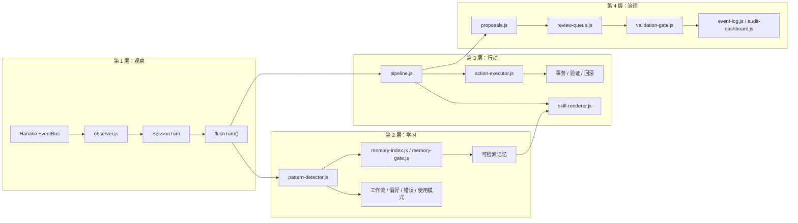
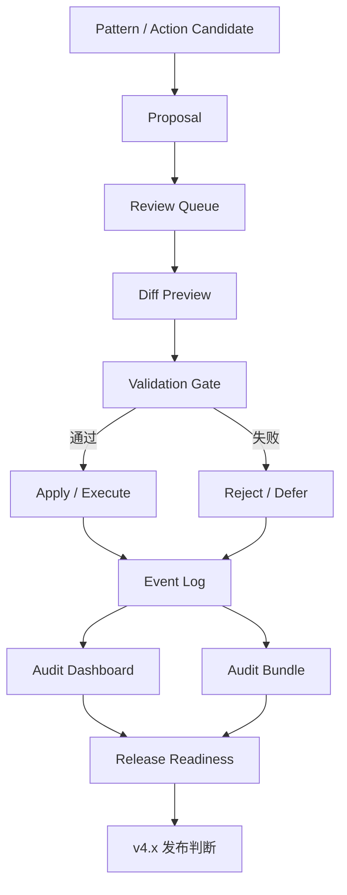

# 架构说明

Runtime Self-Learning `v4.3.17` 当前由 `1` 个入口点、`81` 个 `lib` 模块和一组工具面组成。整体目标不是“尽量自动化”，而是“在不放宽边界的前提下，把本地经验整理成后续可复用的受限提示和低风险动作”。

---

## 一眼看懂

系统可以拆成四层：观察、学习、行动、治理。

这条链路的核心约束有三条：

1. 学到的内容先落到本地结构化数据，再决定是否进入 `SKILL.md`。
2. 所有写入型动作都必须经过风险分级、作用域门、事务和验证。
3. 提案、审核、回滚和发布检查都可追溯，不允许“静默放宽边界”。

---

## 运行链路

### 1. 观察层

- `observer.js` 负责订阅 Hanako 事件、管理会话 turn 生命周期。
- `session-turn.js` 负责记录当前轮的工具调用、报错、用户文本和上下文摘要。
- `flushTurn()` 是单轮学习的统一提交点，后续所有学习和治理动作都从这里发出。

### 2. 学习层

- `pattern-detector.js` 负责摄取、强化、衰减和裁剪模式。
- `pattern-detector-ingest.js` 把原始 turn 归类成工作流、偏好、错误和使用模式。
- `memory-index.js` 构建 CJK 友好的 BM25 倒排索引。
- `memory-gate.js` 和 `scope.js` 做准入控制，拒绝跨项目、过期、已否决或短暂噪声记忆。
- `embeddings.js` 提供可选语义检索和 RRF 融合，但默认关闭。

### 3. 行动层

- `pipeline.js` 负责 post-flush 流水线调度，包括修剪、技能刷新、提案生成、自动动作候选和模型顾问入口。
- `action-executor.js` 负责动作分发，支持 patch、测试、诊断、一次性修复等。
- `action-registry.js` 维护动作定义、验证器和回滚器。
- `action-transaction.js`、`scope-gate.js`、`filesystem-boundary.js` 一起保证写入动作可回滚、不越界。
- `command-allowlist.js` 和 `project-script-trust.js` 约束命令执行边界。

### 4. 治理层

- `proposals.js` 管提案生命周期和内容哈希绑定。
- `review-queue.js` 管人工审核流和 review 状态。
- `validation-gate.js` 是统一守门员，负责配置 patch、技能 patch、动作计划和 doctor 关键状态检查。
- `event-log.js` 记录全部治理事件；`audit-dashboard.js`、`audit-bundle.js` 负责汇总输出。
- `release-readiness.js` 负责发布门检查，确认版本、文档、冻结契约和验收状态一致。

---

## 治理与发布链路

运行时学习只是前半段，真正决定是否“对外生效”的是治理链路。

这条链路背后的原则是：

- 写文件和改配置是两套不同的约束面，但都必须可审计。
- 高风险动作可以被识别，但不会因此自动放行。
- 发布检查只消费本地事实，不负责执行外部发布动作。

---

## 子系统地图

### 核心运行时

| 文件 | 责任 |
|---|---|
| `observer.js` | EventBus 订阅、会话 turn 生命周期、`flushTurn` 编排。 |
| `session-turn.js` | 记录每轮工具、错误、用户输入和上下文信息。 |
| `pattern-detector.js` | 模式摄取、强化、衰减、裁剪、关联边维护。 |
| `pattern-detector-ingest.js` | 工作流 / 偏好 / 错误 / 使用模式的模式生成。 |
| `pipeline.js` | flush 后流水线和自动动作编排。 |

### 检索与记忆

| 文件 | 责任 |
|---|---|
| `memory-index.js` | CJK 友好的 BM25 倒排索引与 bigram 分词。 |
| `memory-gate.js` | 记忆准入控制。 |
| `scope.js` | 项目与任务类型作用域推断和匹配。 |
| `embeddings.js` | 可选语义搜索和 RRF 融合。 |
| `helpers.js` | 分类、去重、纠正提取和辅助磁盘同步。 |

### 执行与安全

| 文件 | 责任 |
|---|---|
| `action-executor.js` | 动作主分发。 |
| `action-registry.js` | 动作注册、验证、执行、回滚。 |
| `action-transaction.js` | 文件级事务快照、提交、回滚。 |
| `command-allowlist.js` | 命令 allowlist / denylist 和脚本信任。 |
| `filesystem-boundary.js` | 基于 realpath 的文件系统边界校验。 |
| `scope-gate.js` | 预执行 diff 预览和作用域判定。 |
| `project-script-trust.js` | `package.json` 脚本信任基线和变更探测。 |

### 治理与审计

| 文件 | 责任 |
|---|---|
| `proposals.js` | 提案 CRUD、diff 预览、哈希绑定。 |
| `review-queue.js` | 审核队列和 review 状态。 |
| `validation-gate.js` | 风险和配置合法性验证。 |
| `agent-controller.js` | 修复 / 回滚 / 人工中断任务状态机。 |
| `release-readiness.js` | LTS 发布契约检查。 |
| `audit-dashboard.js` | 汇总可读治理视图。 |
| `audit-bundle.js` | 导出审计包。 |

### 技能晋升

| 文件 | 责任 |
|---|---|
| `skill-promotion-loop.js` | 从候选到激活的端到端晋升链。 |
| `skill-promotion-store.js` | 候选和激活技能注册表持久化。 |
| `skill-promotion-decision.js` | 合并、吸收、转移和 upsert 决策。 |
| `skill-renderer.js` | 根据模式和注册表生成 `SKILL.md`。 |
| `skill-lifecycle.js` | `SKILL.md` 快照、备份和变更检测。 |

### 跨项目迁移

| 文件 | 责任 |
|---|---|
| `cross-project-scope.js` | 跨项目迁移候选的校验和安全规则。 |
| `transfer-registry.js` | 迁移候选登记、验证记录和过期控制。 |
| `transfer-validation-runner.js` | 在目标项目执行验证命令。 |

### 基础设施

| 文件 | 责任 |
|---|---|
| `common.js` | 公共导出和 `nowIso()`。 |
| `json-io.js` | 原子化 JSON 读写。 |
| `jsonl-utils.js` | JSONL 尾部读取。 |
| `atomic-file.js` | `tmp + rename` 文件写入。 |
| `scoring.js` | 衰减评分、知识层级和装饰。 |
| `activity-log.js` | 批量 JSONL 追加和裁剪。 |
| `event-log.js` | 审计事件追加、回放和校验。 |
| `config-defaults.js` | 默认配置。 |
| `hana-runtime-compat.js` | Hanako 插件系统兼容层。 |

---

## 数据对象与持久化

主要持久化对象如下：

| 对象 | 说明 |
|---|---|
| `patterns.json` | 主学习存储，包含模式、关系、评分、证据和状态。 |
| `facts.json` | 长期事实记忆，支持 supersession。 |
| `event_log.jsonl` | 追加写审计事件链。 |
| `action_feedback.jsonl` | 自动动作执行结果、验证结果和反馈权重输入。 |
| `config.json` | 非敏感配置主文件。 |
| `credentials.enc` | 敏感凭证加密存储。 |
| `memfs/` | 从机器存储派生出来的人类可读视图。 |

所有关键 JSON 写入都通过原子写路径完成，避免崩溃后出现半写文件。

---

## 关键设计决策

1. **零运行时依赖**
   检索、索引和治理链不依赖 SQLite 或外部分词器，降低部署复杂度和审计面。

2. **遗忘曲线而不是简单累加**
   低频、陈旧、无证据的模式会自然衰减，高频或长期知识可以保留。

3. **作用域优先于相似度**
   搜到不代表能用。跨项目、跨任务、已否决、越界模式会先被 gate 掉，再谈排序。

4. **事务优先于写入**
   R2 及以上写动作必须先建立快照，验证失败直接回滚。

5. **命令和脚本都必须显式信任**
   即便是插件声明的命令，也不能绕过 allowlist 和 denylist。

6. **治理链独立于学习链**
   学到内容不等于自动生效；提案、审核、验证、应用、审计是另一条清晰链路。

7. **发布门只做判定，不做副作用**
   `release:check` 只检查本地状态，不执行 tag、push、publish。

---

## 读图建议

如果你要快速接手代码库，建议按这个顺序读：

1. `observer.js` 和 `session-turn.js`
2. `pattern-detector.js`、`memory-index.js`、`memory-gate.js`
3. `pipeline.js`、`action-executor.js`、`action-transaction.js`
4. `proposals.js`、`review-queue.js`、`validation-gate.js`
5. `release-readiness.js`、`audit-dashboard.js`

这样能先抓到主链，再看边上的治理和长期维护部件。
