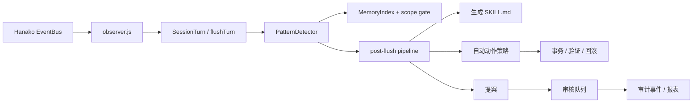

# Runtime Self-Learning

<p align="center">
  <sub>Hanako 本地运行时自学习引擎</sub>
</p>

<p align="center">
  
  
  
  
  
  
</p>

Runtime Self-Learning 会观察本地 Hanako 对话中的重复工作流、用户纠正、常见报错和大上下文使用模式，把经过证据约束的经验整理成后续会话可用的保守提示。

设计目标很简单：让 Hanako 记住本地有价值的经验，但不扩大自动化边界。数据默认只保存在本机目录；外部模型调用和语义检索默认关闭，只有显式配置后才会启用。

## 核心能力

| 领域 | 行为 |
|---|---|
| 工作流学习 | 连续观察到 3 次以上的稳定工具类别序列后，提炼为可复用工作流模式。 |
| 偏好学习 | 记录用户纠正、固定偏好和带证据的长期事实。 |
| 错误学习 | 把重复错误转成修复建议，并提示“不要盲重试”。 |
| 使用模式学习 | 记录大上下文、失败请求和资源使用特征。 |
| 检索 | 使用 CJK 友好的 BM25、作用域门禁、关系加权和可选语义融合。 |
| 技能注入 | 将高置信、受预算限制的提示写入生成的 `SKILL.md`。 |
| 治理 | 所有提案经过校验、审核队列、审计事件和健康检查。 |
| 自动动作 | 只允许低风险、可回滚、可验证的动作通过策略门执行。 |

## 安全边界

插件故意做得保守，默认行为是“看得见才放行、看不清就拒绝”。

| 类别 | 规则 |
|---|---|
| R4 / 高影响动作 | 永不自动执行。 |
| 外部写操作 | 永不自动执行。 |
| `git push` / `git tag` / release / publish | 永不自动执行。 |
| 文件写入 | 必须经过作用域门、事务快照、验证和回滚。 |
| R2 修复动作 | 只允许一次受控修复；失败即回滚。 |
| 项目脚本执行 | 必须先建立 `package.json` 脚本信任基线。 |
| 主动技能注入 | 默认关闭。 |
| 模型顾问 / 语义检索 | 默认关闭；凭证独立保存并加密。 |

运行时采用 fail-closed 策略：未知命令、未知配置键、非法提案、doctor 关键状态和越界作用域变更都会被拦下，而不是靠猜测继续执行。

## 安装

最新版本：

```powershell
git clone https://github.com/326sun/Hanako-runtime-learner.git
cd Hanako-runtime-learner
npm run install-plugin
```

固定版本安装：

```powershell
git clone --branch v4.3.23 https://github.com/326sun/Hanako-runtime-learner.git
cd Hanako-runtime-learner
npm run install-plugin
```

升级：

```powershell
git pull
npm run install-plugin
```

升级时不要删除 `~/.hanako/self-learning`，除非你明确要清空学习记录。

## 数据与隐私

本地数据默认位于：

```text
~/.hanako/self-learning/
```

关键文件：

| 文件 | 作用 |
|---|---|
| `patterns.json` | 工作流、偏好、错误、使用模式等学习结果。 |
| `facts.json` | 带时间感知和淘汰链的事实记忆。 |
| `event_log.jsonl` | 追加写审计事件链。 |
| `action_feedback.jsonl` | 自动动作执行结果和策略反馈。 |
| `SKILL.md` | 后续会话注入的受限提示。 |
| `memfs/` | 面向人类阅读的长期记忆 Markdown 视图。 |

敏感片段会被脱敏。API Key 和 embedding 凭证迁移后不会以明文形式长期保存在配置文件里。

## 工具面

| 工具 | 说明 |
|---|---|
| `self_learning_search` | 带作用域门的记忆检索：BM25 + 门禁 + 重排 + 可选语义融合。 |
| `self_learning_stats` | 查看当前统计、配置、能力和数据规模。 |
| `self_learning_report` | 输出可读的学习报告和待处理提案。 |
| `self_learning_activity` | 最近学习活动时间线。 |
| `self_learning_doctor` | 只读健康检查，返回严重级别和修复建议。 |
| `self_learning_control` | 治理入口：审核、策略、审计导出、发布就绪度、任务控制等。 |
| `self_learning_open_dir` | 打开本地自学习数据目录。 |

常见控制动作：

```text
self_learning_control action=status
self_learning_control action=doctor
self_learning_control action=review_panel
self_learning_control action=list_proposals
self_learning_control action=validate_proposal proposalId=<id>
self_learning_control action=approve_review reviewId=<id>
self_learning_control action=apply_review reviewId=<id>
self_learning_control action=set_policy_profile governanceProfile=conservative
self_learning_control action=regenerate_memfs
self_learning_control action=release_readiness
```

## 配置重点

默认值已经偏向本地保守使用。最常调整的是下列键：

| 键 | 默认值 | 说明 |
|---|---:|---|
| `governanceProfile` | `balanced` | 内置档位：`conservative`、`balanced`、`autonomous`。 |
| `autoInjectHighConfidence` | `true` | 允许高置信经验进入 `SKILL.md`。 |
| `includePendingPreferences` | `false` | 待审核偏好默认不参与注入。 |
| `decayHalfLifeDays` | `30` | 记忆衰减半衰期。长期知识不随普通模式一起衰减。 |
| `activeSkillsInjectionEnabled` | `false` | 已激活技能默认不主动注入。 |
| `modelAdvisorEnabled` | `false` | 关闭时不会发生外部模型调用。 |
| `semanticSearchEnabled` | `false` | 关闭时只使用本地 BM25。 |
| `officialMemoryBridgeEnabled` | `true` | 启用只读官方记忆桥。 |

`autoActions` 和 `autoActionCommands` 采用深合并配置，局部 patch 不会抹掉其余默认项。

## 架构概览

Runtime Self-Learning 是一条“四层流水线”：观察、学习、行动、治理。



关键设计决策：

- 运行时零 npm 依赖。
- 自带 CJK 友好的 BM25 倒排索引和 bigram 分词。
- 跨项目记忆默认拒绝，除非显式标注为 general/global。
- 使用遗忘曲线和知识层级控制记忆衰减。
- JSON 写入统一走 `tmp + rename`，避免半写状态。
- 审计事件是追加写链式日志，支持回放和校验。
- v4.x LTS 期间维持冻结的安全边界。

更完整的模块图和治理链路见 [ARCHITECTURE.md](ARCHITECTURE.md) 与 [docs/API_FREEZE.md](docs/API_FREEZE.md)。

## 开发

要求 Node.js 18+。

```powershell
npm run check          # 语法与源代码检查
npm test               # 665 个测试
npm run benchmark      # 17 个内置基准场景
npm run perf           # 热路径微基准
npm run complexity:check   # 复杂度预算门禁（超 hard limit 即失败）
npm run complexity:report  # 生成 docs/COMPLEXITY_REPORT.md
npm run release:check  # 发布元数据与 LTS 契约检查（含复杂度预算）
```

当前热路径基线（以有界运行规模 `N=100 = MAX_PATTERN_COUNT * 2` 为准）：

| 指标 | 典型本地结果 |
|---|---:|
| `search_ms` | ~0.03 ms |
| `decorate_ms` | ~0.02 ms |
| `skill_render_ms` | ~0.03 ms |
| `prune_ms` | ~0.05 ms |
| `all_cold_ms` | ~0.03 ms |
| `all_cached_ms` | ~0.00004 ms |
| 冷启动 import | ~27 ms |

`npm run perf` 是性能护栏，不是强制发布门，但很适合抓热路径回退。

## 发布检查表

发布前执行：

```powershell
npm run check
npm test
npm run benchmark
npm run perf -- --json
npm run release:check
```

`v4.3.23` 的预期结果：

```text
package version: 4.3.23
npm run check: passed
npm test: 665 tests, 665 passed, 0 skipped
npm run benchmark: passed, 17 scenarios
npm run perf: passed, no threshold breaches
npm run release:check: Score 100
```

发布门不会执行 `git tag`、`git push`、`npm publish` 或任何外部副作用，它只检查本地文件和发布就绪度。

## 文档索引

| 文档 | 用途 |
|---|---|
| [INSTALL.md](INSTALL.md) | 安装、升级、卸载和排障。 |
| [ARCHITECTURE.md](ARCHITECTURE.md) | 模块分层、数据流和治理链路。 |
| [docs/GOVERNANCE.md](docs/GOVERNANCE.md) | 提案、审核、doctor 和审计治理。 |
| [docs/ACTION_API.md](docs/ACTION_API.md) | 动作插件 API。 |
| [docs/POLICY.md](docs/POLICY.md) | 风险分级与策略门。 |
| [docs/TRANSACTION.md](docs/TRANSACTION.md) | 事务、验证与回滚模型。 |
| [docs/SANDBOX.md](docs/SANDBOX.md) | 命令与文件系统边界。 |
| [docs/SKILL_PROMOTION.md](docs/SKILL_PROMOTION.md) | 基于证据的技能晋升。 |
| [docs/AUDIT.md](docs/AUDIT.md) | 审计事件、报表和导出。 |
| [docs/BENCHMARKS.md](docs/BENCHMARKS.md) | 基准场景与解释。 |
| [docs/MIGRATION_v3_to_v4.md](docs/MIGRATION_v3_to_v4.md) | v3 到 v4 迁移说明。 |
| [docs/LTS_MAINTENANCE_PLAN.md](docs/LTS_MAINTENANCE_PLAN.md) | v4.x LTS 维护策略。 |
| [docs/DESIGN_GOAL_COMPLETION_MATRIX.md](docs/DESIGN_GOAL_COMPLETION_MATRIX.md) | 设计目标完成矩阵。 |
| [docs/ACCEPTANCE-v4.3.23.md](docs/ACCEPTANCE-v4.3.23.md) | 当前版本验收记录。 |
| [CHANGELOG.md](CHANGELOG.md) | 版本历史。 |

## 许可证

[MIT](LICENSE) © Sun
