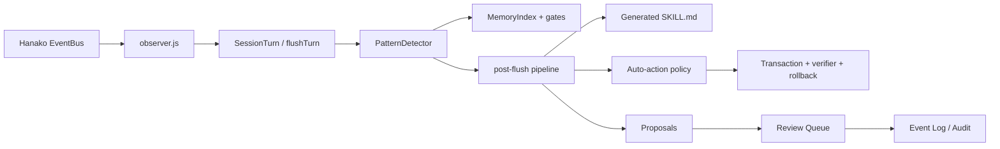

# Runtime Self-Learning

<p align="center">
  <sub>Hanako plugin · local runtime learning engine</sub>
</p>

<p align="center">
  
  
  
  
  
  
</p>

Runtime Self-Learning observes local Hanako conversations, learns repeated workflows, durable preferences, recurring errors, and large-context usage patterns, then injects conservative evidence-backed hints into later sessions.

The design goal is simple: let Hanako remember useful local experience without widening automation boundaries. Data is stored under your local Hanako directory. External model or embedding calls are off by default and only run after explicit configuration.

## What It Does

| Area | Behavior |
|---|---|
| Workflow learning | Detects repeated tool-category sequences after 3+ occurrences. |
| Preference learning | Stores user corrections and pinned memory with evidence. |
| Error learning | Converts repeated errors into repair guidance and no-blind-retry hints. |
| Usage learning | Records large-context and failed model-request patterns. |
| Retrieval | Uses CJK-aware BM25, scope gates, relation boosts, and optional semantic RRF fusion. |
| Skill injection | Writes bounded high-confidence hints into the generated `SKILL.md`. |
| Governance | Routes proposals through validation, review queue, audit events, and doctor checks. |
| Auto actions | Executes only low-risk, bounded actions through policy gates, transactions, verification, and rollback. |

## Safety Boundaries

The plugin is intentionally conservative.

| Category | Rule |
|---|---|
| R4 / high-impact actions | Never auto-executed. |
| External writes | Never auto-executed. |
| `git push`, `git tag`, release, publish | Never auto-executed. |
| File writes | Require scope gate, transaction snapshot, verification, and rollback. |
| R2 repair | One-shot only, verification-gated, rollback on failure. |
| Project scripts | Require explicit package-script hash trust. |
| Active skill injection | Off by default. |
| Model advisor / semantic search | Off by default; credentials are stored separately and encrypted. |

The runtime is fail-closed: unknown commands, unknown config keys, invalid proposals, stale doctor-critical states, and unsafe scope changes are blocked instead of guessed through.

## Installation

Latest:

```powershell
git clone https://github.com/326sun/Hanako-runtime-learner.git
cd Hanako-runtime-learner
npm run install-plugin
```

Pinned release:

```powershell
git clone --branch v4.3.2 https://github.com/326sun/Hanako-runtime-learner.git
cd Hanako-runtime-learner
npm run install-plugin
```

Upgrade:

```powershell
git pull
npm run install-plugin
```

Do not delete `~/.hanako/self-learning` during upgrades unless you intentionally want to reset learned memory.

## Data And Privacy

Runtime data is local by default:

```text
~/.hanako/self-learning/
```

Important files:

| File | Purpose |
|---|---|
| `patterns.json` | Learned workflows, preferences, errors, usage patterns. |
| `facts.json` | Time-aware factual memory with supersession. |
| `event_log.jsonl` | Append-only governance and audit event chain. |
| `action_feedback.jsonl` | Auto-action outcomes and policy feedback. |
| `SKILL.md` | Generated bounded hints for later sessions. |
| `memfs/` | Human-readable Markdown view of long-term memory. |

Sensitive evidence snippets are redacted. API keys and embedding credentials are not kept as plaintext config values after credential migration.

## Tools

| Tool | Purpose |
|---|---|
| `self_learning_search` | Scope-aware memory search: BM25 + gate + relation and memory-strength rerank + optional semantic fusion. |
| `self_learning_stats` | Current counts for turns, patterns, proposals, config, host capability data. |
| `self_learning_report` | Human-readable learning report with pending proposals. |
| `self_learning_activity` | Recent learning activity timeline. |
| `self_learning_doctor` | Read-only health checks with severity and suggested actions. |
| `self_learning_control` | Governance surface: review queue, proposal actions, policy profiles, audit export, release readiness, agent tasks, transfer validation. |
| `self_learning_open_dir` | Opens the local self-learning data directory. |

Common control actions:

```text
self_learning_control action=status
self_learning_control action=doctor
self_learning_control action=review_panel
self_learning_control action=list_proposals
self_learning_control action=validate_proposal proposalId=<id>
self_learning_control action=approve_review reviewId=<id>
self_learning_control action=apply_review reviewId=<id>
self_learning_control action=set_policy_profile governanceProfile=conservative
self_learning_control action=regenerate_memfs
self_learning_control action=release_readiness
```

## Configuration

Defaults are safe for local use. The most commonly changed values are:

| Key | Default | Notes |
|---|---:|---|
| `governanceProfile` | `balanced` | Built-in modes: `conservative`, `balanced`, `autonomous`. |
| `autoInjectHighConfidence` | `true` | Allows strong local hints into generated `SKILL.md`. |
| `includePendingPreferences` | `false` | Pending preferences require review unless explicitly enabled. |
| `decayHalfLifeDays` | `30` | Memory decay half-life. Durable knowledge does not decay. |
| `activeSkillsInjectionEnabled` | `false` | Active validated skills stay out of `SKILL.md` unless enabled. |
| `modelAdvisorEnabled` | `false` | Optional background model cleanup; off means no external call. |
| `semanticSearchEnabled` | `false` | Optional embedding search; off means pure local BM25. |
| `officialMemoryBridgeEnabled` | `true` | Read-only bridge to Hanako official memory. |

Nested auto-action settings are deep-merged, so partial config patches do not wipe defaults under `autoActions` or `autoActionCommands`.

## Architecture

Runtime Self-Learning is a four-layer pipeline:



Key design decisions:

- Zero runtime npm dependencies.
- Dependency-free CJK-aware BM25 index with CJK unigrams and bigrams.
- Scope-aware memory gate: cross-project memories are rejected unless general/global.
- Ebbinghaus-style decay plus durable knowledge tiers.
- Atomic JSON writes through tmp+rename.
- Append-only event log with hash-chain verification.
- Frozen v4.x LTS safety boundaries.

See [ARCHITECTURE.md](ARCHITECTURE.md) and [docs/API_FREEZE.md](docs/API_FREEZE.md) for the frozen public contracts.

## Development

Node.js 18+ is required.

```powershell
npm run check          # syntax and source checks
npm test               # 519 项测试
npm run benchmark      # 17 built-in benchmark scenarios
npm run perf           # per-turn hot-path micro-benchmarks
npm run release:check  # release metadata and LTS contract gate
```

Current hot-path baseline at the bounded operating size (`N=100 = MAX_PATTERN_COUNT * 2`):

| Metric | Typical local result |
|---|---:|
| `search_ms` | ~0.03 ms |
| `decorate_ms` | ~0.02 ms |
| `skill_render_ms` | ~0.03 ms |
| `prune_ms` | ~0.05 ms |
| `all_cold_ms` | ~0.03 ms |
| `all_cached_ms` | ~0.00004 ms |
| cold import | ~27 ms |

`npm run perf` is advisory, not a release gate, but it is useful for catching accidental hot-path regressions.

## Release Checklist

Before tagging a release:

```powershell
npm run check
npm test
npm run benchmark
npm run perf -- --json
npm run release:check
```

Expected v4.3.2 state:

```text
package version: 4.3.2
npm run check: passed
npm test: 519 passed, 0 skipped (Windows symlink tests may skip without developer mode)
npm run benchmark: passed, 17 scenarios
npm run perf: passed, no threshold breaches
npm run release:check: Score 100
```

The release gate never performs `git tag`, `git push`, `npm publish`, or any external side effect. It only checks local files and reports readiness.

## v4.3.2 Security Hardening

This release includes a validation-gate fix for two configuration-safety gaps discovered during pre-release audit:

- **Empty denylist blocked**: `validateConfigPatch` now rejects an empty `autoActionCommands.denylist` array. An empty denylist silently drops all default deny patterns (rm, git push, npm publish, etc.), which is a defence downgrade even though `deniedByBuiltinPattern` still provides a hard floor.
- **projectScripts trust warning**: Writing `autoActionCommands.projectScripts` via a generic `config_patch` now produces a high-risk audit warning. Script trust entries should be set through the dedicated `trust_project_scripts` control action, not a blind config merge.
- **Config fallback notification**: When `config.json` is corrupt or missing and the plugin reverts to defaults, an activity log entry and log warning are now recorded instead of silently discarding user configuration.

All three are hardening-only; no automation surface was widened.

## Documentation

| Document | Purpose |
|---|---|
| [INSTALL.md](INSTALL.md) | Installation and upgrade details. |
| [ARCHITECTURE.md](ARCHITECTURE.md) | Module map and design decisions. |
| [docs/GOVERNANCE.md](docs/GOVERNANCE.md) | Proposal/review/doctor/audit governance. |
| [docs/ACTION_API.md](docs/ACTION_API.md) | Action plugin API. |
| [docs/POLICY.md](docs/POLICY.md) | Policy gate and risk tiers. |
| [docs/TRANSACTION.md](docs/TRANSACTION.md) | Transaction and rollback model. |
| [docs/SANDBOX.md](docs/SANDBOX.md) | Command and filesystem boundaries. |
| [docs/SKILL_PROMOTION.md](docs/SKILL_PROMOTION.md) | Evidence-gated skill promotion. |
| [docs/AUDIT.md](docs/AUDIT.md) | Audit event and report surface. |
| [docs/BENCHMARKS.md](docs/BENCHMARKS.md) | Benchmark corpus. |
| [docs/MIGRATION_v3_to_v4.md](docs/MIGRATION_v3_to_v4.md) | Migration guide. |
| [CHANGELOG.md](CHANGELOG.md) | Release history. |

## License

[MIT](LICENSE) © Sun
