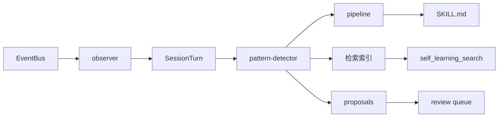

# Runtime Self-Learning

<p align="center">
  <sub>Hanako 插件 · 本地运行时学习引擎</sub>
</p>

<p align="center">
  
  
  
  
  
  
</p>

观察你的交互，从中提取可复用的经验，自动注入到 Hanako Agent 的后续会话中。重复的工作流、反复触发的错误、明确的纠正——全部本地处理，默认不外发任何数据。

```powershell
# 当前最新版
git clone https://github.com/326sun/Hanako-runtime-learner.git
cd Hanako-runtime-learner
npm run install-plugin

# 固定版本
git clone --branch v4.3.0-lts https://github.com/326sun/Hanako-runtime-learner.git
cd Hanako-runtime-learner
npm run install-plugin
```

升级：`git pull && npm run install-plugin`

## Runtime Auto Action v2.0

`Runtime Self-Learning` 现在具备低/中风险自动执行闭环：

```text
Observe → Trigger → Plan → Policy Gate → Execute → Verify → Feedback → Learn
```

核心边界：

- 低风险动作可自动执行，例如错误诊断、一次性 backoff retry、只读文件定位、测试/检查命令。
- 中风险动作必须经过 Policy Gate，并具备 verification 与 rollback plan；写入类动作通过 transaction 保护。
- 高风险动作只生成 `action_plan` 并进入 Review Queue，不自动执行。
- 删除文件、`git push`、`git tag`、`npm publish`、发布、外部写请求、密钥/凭证修改等动作永不自动执行。

新增运行时模块位于 `lib/`：

```text
action-triggers       触发器
action-planner        行动计划生成
action-risk           R0-R4 风险分级
action-types          动作类型定义
action-executor       受限执行器
action-transaction    可回滚写入事务
action-patcher        精确文本补丁
policy-profiles       策略配置档
evaluation-runner     执行后验证与指标
evaluation-metrics    验证指标定义
```

生成的数据文件：

```text
action_feedback.jsonl        每次自动执行的 before/after/verification
action_policy_weights.json   actionType 成功率与自动执行权重
```


### Runtime Auto Action v4.3.0 LTS：最终硬化补丁

`v4.3.0` 将中风险写入动作从基础 transaction 推进到可验证的小补丁执行：

- `apply_patch_sandboxed` 支持 `filePatches` 精确文本补丁，`oldText` 默认必须唯一匹配，避免误改多处。
- 支持 `verifyCommands`，例如 `node --check file.js`、`npm test`、`npm run check`，命令仍受 allowlist/denylist 限制。
- 验证失败时自动 rollback，恢复 transaction snapshot。
- 支持一次受控 `repairPlan`，修复后重新验证；仍失败则回滚。
- 新增验证指标：`patch_applied`、`verification_commands_pass`、`rollback_clean`。

R2 自动写入仍必须满足：Policy Gate 通过、存在 rollback plan、存在 verification、命令在 allowlist 内、diff scope 不超限。

### Runtime Auto Action v4.3.0 LTS：维护硬化

`v4.3.0-lts` 保持最终 LTS 契约，同时补上发布前机器门禁：

- Action / Policy / Transaction / Sandbox / Skill Promotion / Audit / Benchmarks API 文档齐备。
- Benchmark corpus 覆盖 17 个系统级场景。
- 插件 action 的 `execute.js` / `verify.js` / `rollback.js` 走子进程隔离。
- Agent Controller 具备显式 repair / rollback 分支。
- Skill Promotion 已形成 reflexion → candidate → active registry 闭环。
- `active_skills.json` 默认不注入 `SKILL.md`；如需注入，必须显式开启 `activeSkillsInjectionEnabled`。
- 新增 `npm run release:check` 与 `self_learning_control action=release_readiness`，用于检查 package/package-lock、CHANGELOG、ACCEPTANCE、API freeze、LTS 文档和 benchmark corpus 的发布一致性。
- R4、外部副作用、发布、删除、密钥修改仍永不自动执行。

冻结文档见：

```text
docs/ACTION_API.md
docs/POLICY.md
docs/TRANSACTION.md
docs/SANDBOX.md
docs/SKILL_PROMOTION.md
docs/AUDIT.md
docs/BENCHMARKS.md
docs/MIGRATION_v3_to_v4.md
docs/API_FREEZE.md
```

## 管道

四层架构：事件捕获 → 模式检测 → 记忆管理与衰减 → 检索与治理。



核心设计决策：

**零运行时依赖** — 纯 JS BM25 倒排索引，CJK 单字加二元组分词，无需 SQLite 或外部分词器。

**艾宾浩斯遗忘曲线** — `score × e^(-λt)`，高频持久，低频自然淘汰。手动批准的模式永不衰减。

**作用域感知检索** — 按项目隔离记忆，跨项目硬拒绝，跨任务软降权。

**原子 I/O** — `writeJson` 通过 `rename` 保证并发安全；mtime 缓存跳过无效磁盘重读。

完整调用拓扑见 [`ARCHITECTURE.md`](ARCHITECTURE.md)。

## API

| 工具 | 用途 |
|---|---|
| `self_learning_search` | 作用域感知检索：BM25 + Gate + 关系重排 + 可选语义 RRF |
| `self_learning_doctor` | 只读健康检查：Good / Warning / Critical + 修复建议 |
| `self_learning_stats` | 统计总览：turns / patterns / proposals / 配置 |
| `self_learning_report` | 结构化学习报告，含待处理提案 |
| `self_learning_activity` | 近 N 天学习活动时间线 |
| `self_learning_control` | 审批、proposal 管理、review queue、diff preview、策略切换、事件链验证、审计导出 |
| `self_learning_open_dir` | 打开数据目录 |

## 配置

完整配置开箱即用。外部网络功能（模型顾问、语义检索）默认关闭，需显式开启。

### 注入与审批

| 键 | 默认 | 说明 |
|---|---|---|
| `governanceProfile` | `balanced` | 策略档：`conservative` / `balanced` / `autonomous` |
| `autoInjectHighConfidence` | `true` | 高置信 pattern 自动注入 SKILL.md |
| `autoApproveHighConfidence` | `true` | 高置信 pattern 免审批 |
| `minInjectScore` | `8` | 注入最低衰减分数 |
| `minInjectCount` | `2` | 注入最少触发次数 |
| `decayHalfLifeDays` | `30` | 艾宾浩斯半衰期，天 |
| `includePendingPreferences` | `false` | 未审核偏好注入开关；默认关闭，未审核纠正仅可检索 |
| `requireReviewForAutoApply` | `false` | 严格审核模式：auto-apply proposal 进入 Review Queue |
| `activeSkillsInjectionEnabled` | `false` | 是否允许 `active_skills.json` 中的 active skill 进入渲染后的 `SKILL.md` |
| `activeSkillsInjectionMaxCount` | `3` | active skill 最多注入条数 |
| `activeSkillsInjectionMinSuccess` | `7` | active skill 注入所需最少成功证据 |
| `activeSkillsInjectionMaxRegression` | `0` | active skill 注入允许的最大回归次数 |

### 模型顾问

关闭时零外发。

| 键 | 默认 | 说明 |
|---|---|---|
| `modelAdvisorEnabled` | `false` | 开启后整理 workflow / error / usage 模式。Hanako ≥ 0.305 优先走宿主 utility 模型采样，provider 凭证不经过插件；旧版本或 bus 不可用时回退到配置端点 |
| `modelAdvisorSource` | `official` | `official` / `private` / `off` |
| `modelAdvisorMinIntervalMinutes` | `60` | 最小调用间隔 |
| `modelAdvisorMaxTokens` | `500` | 单次最大输出 |

### 语义检索

关闭时零外发。

| 键 | 默认 | 说明 |
|---|---|---|
| `semanticSearchEnabled` | `false` | 开启后外发查询词与候选文本到 embedding 端点 |
| `semanticEmbeddingBaseUrl` | — | OpenAI 兼容 Base URL |
| `semanticEmbeddingApiKey` | — | API Key |
| `semanticEmbeddingModel` | — | 模型名称 |
| `semanticCacheMaxEntries` | `1000` | 本地向量缓存上限 |

高级调优键（仅 `DEFAULT_CONFIG`，不在设置 UI 暴露）：`maxSkillTokens`、`retrievalCandidateLimit`、`minRetrievalRelative`、`crossTaskPenalty`、`minRetrievalConfidence`、`semanticTopK`、`rrfK`、`durableMemoryMaxCount`。

## 检索

BM25 倒排索引 → 准入 Gate → 关系 / 记忆强度重排 → 可选语义 RRF 融合。

**CJK 分词** — 单字加相邻二元组，`排版` 可命中 `论文排版`，无需外部分词器。

**跨语言同义词** — `coding` ↔ `代码`，`workflow` ↔ `工作流`。

**作用域隔离** — 跨项目记忆硬拒绝（`general` 为通配 sentinel），跨任务软降权。

**语义检索**默认关闭。开启后按内容哈希缓存向量到 `embeddings_cache.json`，端点失败自动退化为纯 BM25。

## 治理

学习结果进入可审计治理链：Proposal → Review Queue → Validation Gate → Event Log。Doctor 健康检查、策略配置档、MemFS 视图、审计包导出与操作示例见 [`docs/GOVERNANCE.md`](docs/GOVERNANCE.md)。

## 数据与隐私

纯本地，路径 `~/.hanako/self-learning/`。`self_learning_open_dir` 可随时打开查看或手动删除。

**本地留存** — `experience_log.jsonl` 保留每轮意图与纠正原文，30 天窗口自动清理。`patterns.json` 中的 preference 原文按 `durableMemoryMaxCount` 上限保留。证据链中的敏感片段（密钥、邮箱、令牌）自动脱敏，仅保存原文哈希用于去重。

**默认不外发**。仅当显式开启 `modelAdvisorEnabled` 或 `semanticSearchEnabled` 时才会外发数据。`preference` 与 `durable` 模式（用户纠正原文、`pin_memory` 内容）永不外发。

## 开发

零外部 npm 依赖，Node ≥ 18。

```powershell
npm run check      # 源文件语法检查
npm test           # 496 项测试
npm run benchmark  # 内置 benchmark corpus，输出 Markdown/JSON 报告
npm run release:check  # LTS 发布契约检查：版本、文档、验收报告、benchmark corpus
```

项目结构与完整调用拓扑见 [`ARCHITECTURE.md`](ARCHITECTURE.md)。

[MIT](LICENSE) © Sun

### v4.3.0 LTS benchmark corpus

`v4.3.0-lts` 内置 benchmark 场景语料库，覆盖运行时诊断、大上下文任务分解、安全命令执行、验证失败后回滚、越界写入拦截。报告默认输出到 `benchmark-results/`：

```powershell
npm run benchmark
```

Benchmark runner 用 `benchmarks/baseline-v4.0.9.json` 和 `benchmarks/thresholds.json` 对比当前指标，回归会导致命令失败。

### v4.3.0 LTS release readiness gate

`v4.3.0-lts` 提供发布就绪门禁，服务于最终 LTS 分发路径。门禁保守设计：只检查发布元数据和文档，永不执行 `git tag`、`git push`、`npm publish` 或任何外部副作用。

```bash
npm run release:check
node scripts/release-readiness.js --output-dir release-readiness
```

同一检查可通过 `self_learning_control` 的 `action=release_readiness` 触发，会在学习数据目录下写入 `release-readiness.md/json` 并记录本地审计事件。

### v4.3.0 LTS 最终硬化

`v4.3.0-lts` 是 v4.x 主路线完成版，在保持 v4.0 LTS 设计不变的前提下收尾以下工程边界：

- `manifest.json`、`package.json`、`package-lock.json` 版本统一为 `4.3.0-lts`。
- sandbox command allowlist 拒绝 shell 复合符、重定向、命令替换和变量展开。
- filesystem boundary 改为 symlink-aware，防止 workspace 内 symlink 指向外部路径后被读写。
- 命令 denylist 改为 token/segment-aware，不再因文件名中包含 `rm` 误伤安全命令，同时仍阻断 `rm -rf`、`git push`、`npm publish` 等高风险命令。
- API freeze 以 `docs/API_FREEZE.md` 为准，主架构与自动化边界冻结。
