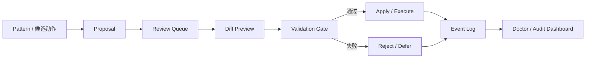

# 学习治理

学习结果不会直接无条件生效，它们会进入一条可审计的治理链，用来阻止模式膨胀、噪声注入和无人监管的自动变更。

---

## 治理总览



---

## 提案类型

| 类型 | 风险 | 说明 |
|---|---|---|
| `skill_patch` | 低 | 更新生成的 `SKILL.md`，严格审查模式下进入 review。 |
| `config_patch` | 中 | 必须经过完整配置校验链。 |
| `code_patch` | 高 | 永不自动写代码，只能人工审核后手动实施。 |
| `action_plan` | R0-R4 | 交给运行时动作策略链处理，而不是直接通过提案写文件。 |

注意：`action_plan` 不通过 `applyProposal` 写入代码，它会先经过 `Policy Gate`，再决定 `auto_execute`、`manual_confirm`、`defer` 或 `reject`。

## Review Queue

Proposal 创建后会自动入队，记录：

- 来源 pattern ID
- 风险等级
- diff 预览
- 当前 validation 状态

常见控制动作：

```text
review_panel
preview_proposal
validate_proposal
approve_review
reject_review
apply_review
```

## Validation Gate

在提案应用前，必须通过统一校验门：

- `code_patch` 始终禁止自动 apply
- `skill_patch` 检查标题、结构和 token 预算
- `config_patch` 检查键白名单、类型、数值范围和枚举值
- doctor 为 `critical` 时阻断 apply

`config_patch` 重点规则：

1. payload 必须是 plain object。
2. key 必须存在于 `DEFAULT_CONFIG`。
3. 数值字段必须落在 `NUMERIC_RANGES` 内。
4. 枚举字段必须命中允许值。
5. `conservative` 档位下的高风险配置会被阻断。

## Event Log

`event_log.jsonl` 是治理主账本。它以追加写方式记录 proposal、review、skill 和动作状态变化，支持：

- 事件回放
- 汇总当前状态
- 导出审计材料

## Rollback

`self_learning_control action=rollback` 会从 `skill_history/` 恢复上一版 `SKILL.md` 快照。当前以技能快照回滚为主，动作级回滚由事务链负责。

---

## Doctor 健康检查

`self_learning_doctor` 只做只读诊断，不直接改文件。输出 `Good`、`Warning`、`Critical` 及修复建议。

常见检查项：

| 检查项 | 含义 |
|---|---|
| `duplicate_patterns` | 重复模式过多。 |
| `conflicting_facts` | 同一事实出现冲突值。 |
| `stale_auto_approved` | 自动批准结果长期未被采纳。 |
| `proposal_backlog` | 提案积压。 |
| `review_backlog` | review 积压。 |
| `scope_leakage` | 可注入模式跨多个具体项目。 |
| `orphan_relations` | 关系边指向已不存在模式。 |
| `evidence_missing` | 高分模式缺证据。 |
| `memfs_stale` | MemFS 视图落后于主存储。 |

---

## MemFS 视图

`patterns.json` 面向机器，`memfs/` 面向人类阅读和 diff。它是派生视图，不是主事实源。

典型结构：

```text
memfs/
|- system/
|- projects/
|- patterns/
`- archive/
```

可通过下面的动作重建：

```text
self_learning_control action=regenerate_memfs
```

---

## 治理策略档

系统内置三种策略档：

| 档位 | 自动注入 | 自动批准 | 待审核偏好 | 严格审查 |
|---|---|---|---|---|
| `conservative` | 关闭 | 关闭 | 关闭 | 开启 |
| `balanced` | 开启 | 开启 | 关闭 | 关闭 |
| `autonomous` | 开启 | 开启 | 开启 | 关闭 |

外部网络相关能力在三种档位下都默认关闭，必须显式配置才会外发。

切换示例：

```text
self_learning_control action=set_policy_profile governanceProfile=conservative
```

---

## Runtime Auto Action v2

自动动作闭环如下：

```text
Trigger -> Action Plan -> Policy Gate -> Transaction -> Executor -> Verifier -> Feedback -> Learning
```

### 风险分级

| 级别 | 含义 | 默认策略 |
|---|---|---|
| R0 | 内部记录、统计、纯诊断 | 自动 |
| R1 | 只读或可忽略副作用 | 自动 |
| R2 | 工作区内可回滚写入或一次性修复 | 自动，但必须验证和可回滚 |
| R3 | 影响长期行为或项目状态 | 人工确认 |
| R4 | 外部不可逆或高影响动作 | 永不自动执行 |

### 永不自动执行

```text
删除项目文件
git push / git tag / release
npm publish
外部 POST / PUT / PATCH / DELETE
发送邮件或消息
修改凭证或放宽策略门
```

### R2 写动作规则

`apply_patch_sandboxed` 和 `execute_repair_once` 这类 R2 动作必须满足：

1. 先建立事务快照。
2. 必须提供验证命令或验证指标。
3. 文本补丁默认要求 `oldText` 唯一匹配。
4. 验证命令必须命中 allowlist 且不命中 denylist。
5. 验证失败时只允许一次受控修复，再失败就回滚。
6. 所有结果都要落到 `action_feedback.jsonl`。

---

## 审计导出

```text
self_learning_control action=export_audit_bundle
```

会生成审计包，其中包含 doctor 汇总、作用域分布、proposal / review 状态和事件回放摘要，并对明显敏感信息做脱敏。
